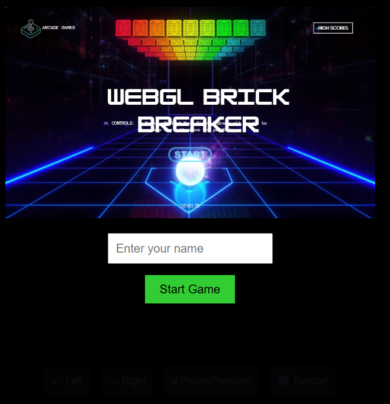
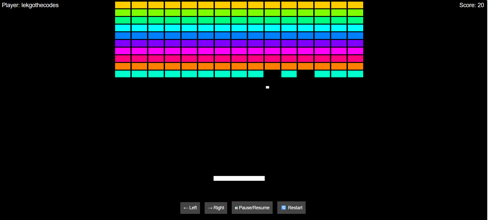
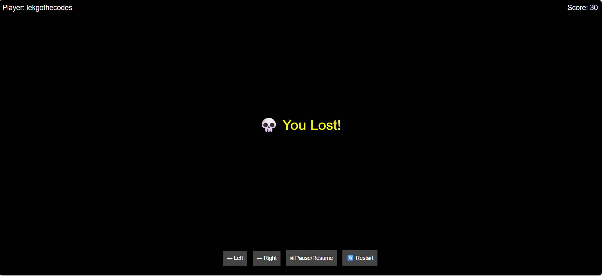

# 🎮 WebGL Brick Breaker Game

## 📌 Description

An interactive browser-based Brick Breaker game developed using JavaScript and WebGL.  
The project demonstrates real-time rendering, collision detection, animation loops, and shader-based graphics programming.

---

# 🚀 Features

- Real-time gameplay
- Keyboard and button controls
- Collision detection system
- Dynamic brick generation
- Pause and restart functionality
- Player score tracking
- WebGL shader rendering
- Interactive start screen

---

# 🛠 Technologies Used

- HTML5
- CSS3
- JavaScript
- WebGL
- GLSL Shaders

---

# ▶️ How to Run the Project

1. Download or clone the repository
2. Open the project folder
3. Run `index.html` in your browser
4. Enter your name
5. Start playing

---

# 🎮 Controls

| Action | Key |
|---|---|
| Move Left | ← Arrow Key |
| Move Right | → Arrow Key |
| Pause/Resume | Pause Button |
| Restart Game | Restart Button |

---

# 📸 Screenshots

## Start Screen

---

## Gameplay

---

## Game Over Screen

---

# 📚 Learning Outcomes

This project helped strengthen my understanding of:

- WebGL rendering pipelines
- GLSL shader programming
- Real-time game loops
- Collision detection
- Interactive browser game development
- Debugging and optimization
- UI integration with graphics rendering

---

# 🔥 Future Improvements

- Sound effects and background music
- Mobile responsive controls
- Difficulty levels
- High score system
- Power-ups and special bricks

---

# 👨‍💻 Author

Lekgothe Ngoepe

GitHub: https://github.com/lekgothecodes

---

# ⭐ Repository Purpose

This repository was created as part of my software development and graphics programming portfolio to demonstrate practical skills in JavaScript, WebGL, and interactive browser-based application development.